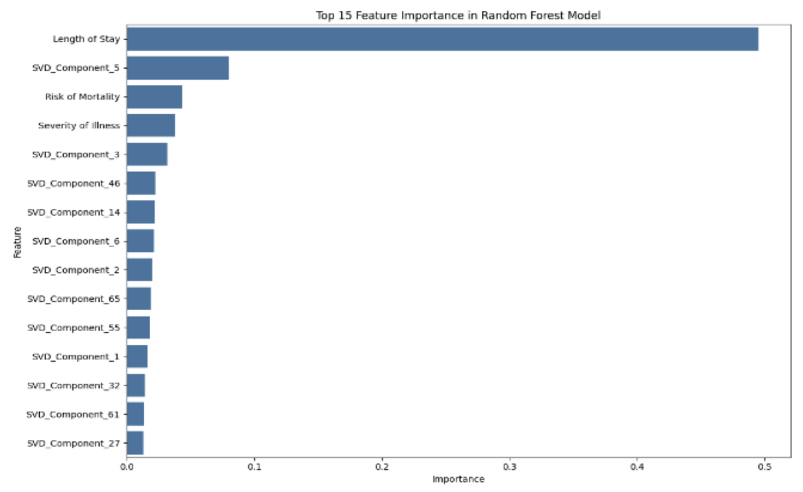
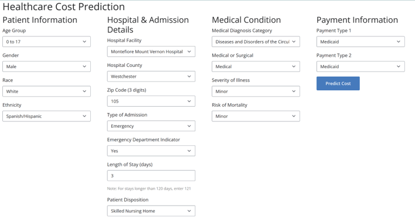

# Predicting Healthcare Costs
Leveraging Google Colab's GPU-Acceleration, machine learning modeling, and interactive web development, this project investigates New York healthcare data to estimate total hospital charges for a patient.

## Data:
[Healthcare Costs](https://health.data.ny.gov/dataset/Hospital-Inpatient-Discharges-SPARCS-De-Identified/22g3-z7e7/about_data) gathered from the New York Government Health Data website.

## Models:
-	Decision Tree
-	Random Forest
-	XGBoost
-	LightGBM
-	Neural Network

## Key Insights:
-	**Influential Factors:** The lenght of stay in the hospital was identified as the most influential feature in predicting total charges, a logically intuitive finding.

  

- **Practical Application:** The design and implementation of the interactive web application using Shiny for Python allowed the users to input patient details and receive real-time estimated healthcare costs, and proved to be of great value based on user's feedback.

  

## Key Technologies:
**Language:** Python

**Libraries:**
- scikit-learn (Modeling and Evaluating)
- tensorflow (Modeling and Evaluating)
- xgboost (XGBoost)
- lightgbm (LightGBM)
- cudf (GPU-Acceleration)
- cuml (GPU-Acceleration)
- cupy (GPU-Acceleration)
- torch (GPU-Acceleration)
- joblib (Parallel Computing)
- matplotlib (Data Visualizations)
- seabron (Data Visualizations)
-	nbconvert (File Format Handling)

**Other Tools:**
- Google Colab
- Shiny for Python (Interactive Web Application)

## Full Project Write-up:
For a detailed narrative, comprehensive methodology, and deeper insights into this project, please read the full write-up on [LinkedIn](https://www.linkedin.com/in/gaelmotahernandez/details/projects/1743566649828/single-media-viewer/?profileId=ACoAAD0sr1oBRU-g7rHenPy0sFhxgU6vSvExSdU).

---
